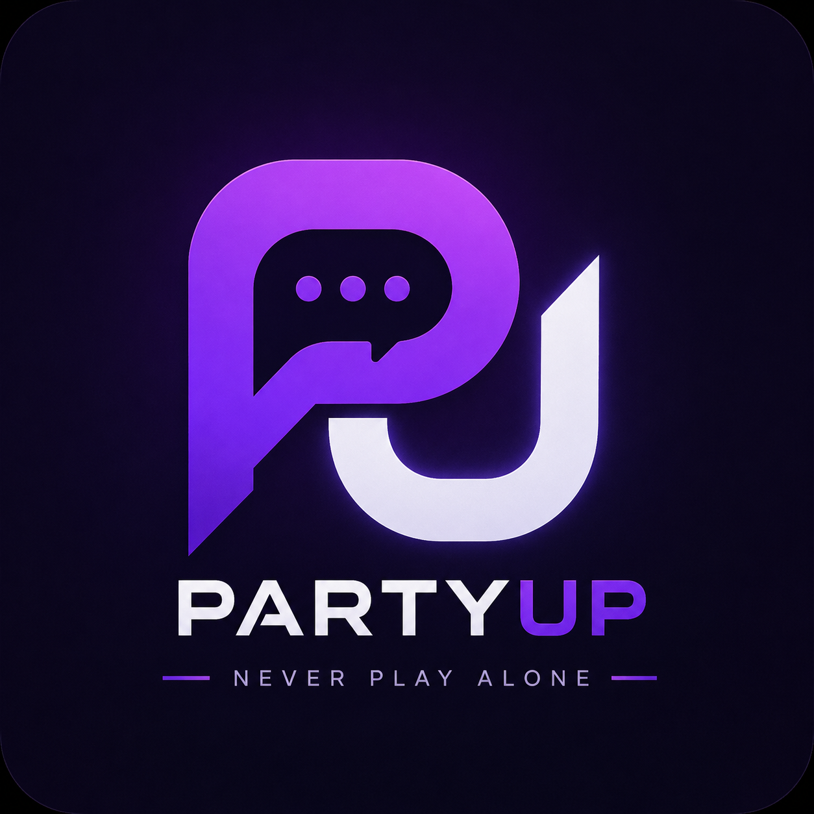
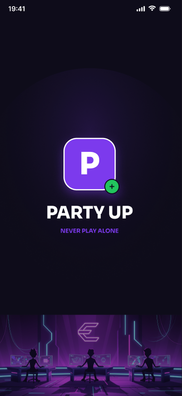
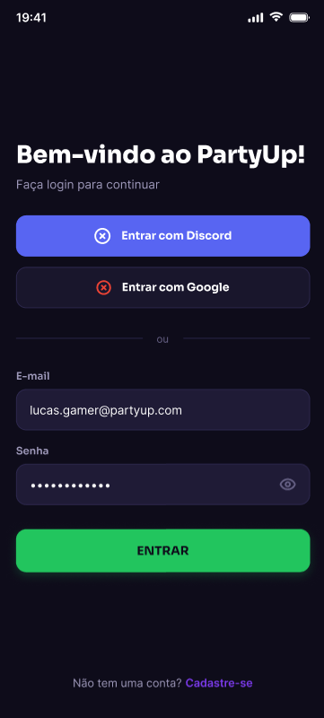
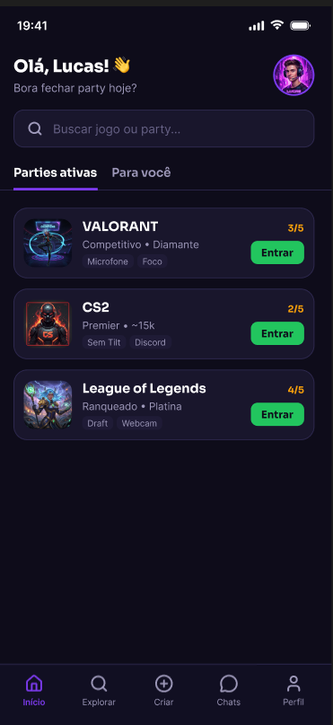
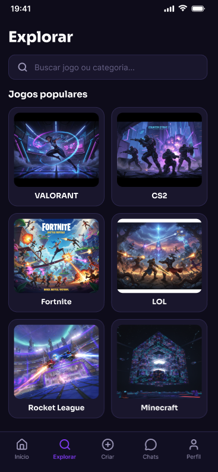
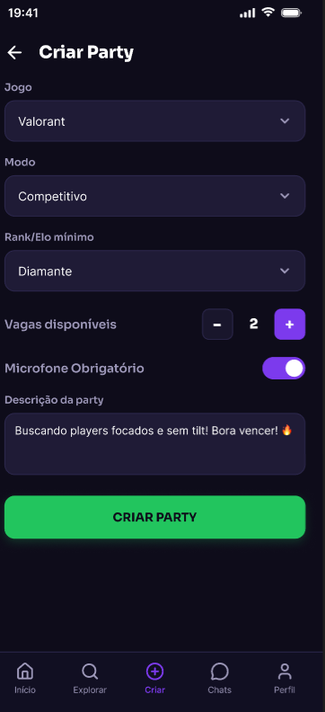
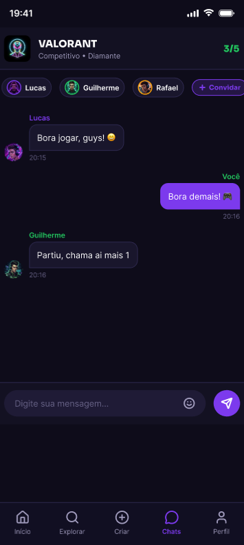
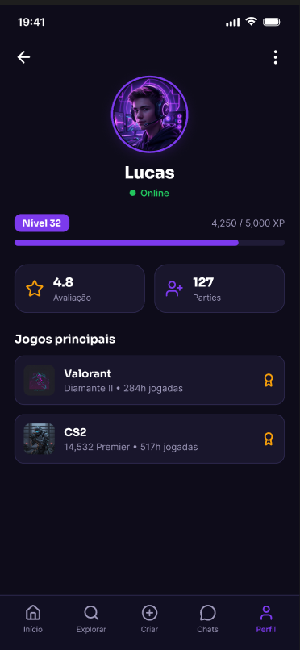

# 🎮 PartyUp

<p align="center">
  <strong>Never Play Alone.</strong>
</p>

<p align="center">
  Uma rede social desenvolvida para conectar jogadores, formar parties e tornar mais fácil encontrar pessoas compatíveis para jogar.
</p>

---

## 📖 Sobre o projeto

O **PartyUp** é um aplicativo mobile desenvolvido em **React Native** que tem como objetivo conectar jogadores que procuram outras pessoas para jogar.

A proposta surgiu a partir de uma situação comum em jogos multiplayer: muitas vezes o jogador quer iniciar uma partida, porém seus amigos estão offline, já estão em outro grupo ou não jogam o mesmo título naquele momento.

O PartyUp busca facilitar esse processo através de uma experiência social focada na criação e descoberta de **parties**, permitindo que jogadores encontrem pessoas de acordo com critérios como jogo, modo de jogo, nível, disponibilidade e estilo de gameplay.

O projeto está sendo desenvolvido durante os **Checkpoints 4, 5 e 6** da disciplina de **Mobile Development & IoT — Engenharia de Software**, evoluindo desde sua concepção até uma aplicação mobile instalável.

---

# ❗ Problema

Jogos multiplayer dependem da interação entre jogadores, mas nem sempre é fácil encontrar pessoas disponíveis e compatíveis para formar uma equipe.

Alguns dos principais problemas identificados são:

* Amigos nem sempre estão disponíveis no mesmo horário;
* Dificuldade para encontrar jogadores do mesmo nível;
* Diferenças entre jogadores casuais e competitivos;
* Falta de comunicação entre os integrantes de equipes aleatórias;
* Comunidades tradicionais podem exigir que o jogador procure manualmente por grupos;
* Falta de informações sobre o comportamento e reputação de jogadores desconhecidos.

O PartyUp pretende reduzir essas dificuldades centralizando a busca por jogadores em uma plataforma criada especificamente para esse propósito.

---

# 💡 Solução

O **PartyUp** funciona como uma rede social voltada para formação de grupos em jogos multiplayer.

O usuário poderá encontrar parties abertas ou criar sua própria party informando características como:

* 🎮 Jogo;
* 🕹️ Modo de jogo;
* 🏆 Rank ou nível;
* 👥 Quantidade de jogadores necessários;
* 🎙️ Necessidade de microfone;
* 🎯 Estilo casual ou competitivo;
* 🌎 Região;
* 🟢 Disponibilidade.

A proposta é transformar o processo de:

> **"Quero jogar, mas não tenho com quem."**

em:

> **"Abra o PartyUp, encontre sua party e jogue."**

---

# 🎯 Público-alvo

O PartyUp é direcionado principalmente para **jogadores de jogos multiplayer online**, tanto de PC quanto de consoles.

O público inclui jogadores:

* Casuais;
* Competitivos;
* Que procuram equipes para partidas ranqueadas;
* Que querem conhecer novos jogadores;
* Que participam de jogos cooperativos;
* Que desejam encontrar pessoas com estilo de gameplay semelhante.

A plataforma busca atender principalmente usuários acostumados com comunidades digitais, jogos online e redes sociais.

---

# 💎 Proposta de valor

> **Conectar jogadores compatíveis de maneira rápida, social e direcionada ao contexto de cada jogo.**

Diferentemente de plataformas generalistas de comunicação, o PartyUp é pensado desde o início para responder uma pergunta específica:

**"Com quem eu posso jogar agora?"**

A plataforma combina descoberta de jogadores, criação de grupos, perfil gamer, comunicação e reputação em uma única experiência.

---

# ✨ Principais funcionalidades planejadas

As funcionalidades serão implementadas progressivamente durante os Checkpoints 5 e 6.

### 🏠 Home

Feed principal contendo parties abertas e recomendações de jogos e jogadores.

### 🔎 Explorar

Área destinada à descoberta de jogos e parties disponíveis.

### ➕ Criar Party

Permite criar um grupo definindo jogo, modo, rank, quantidade de vagas e outras preferências.

### 👥 Entrar em Party

Jogadores poderão visualizar informações de uma party e solicitar ou realizar sua entrada no grupo.

### 💬 Chat

Área de comunicação entre os jogadores que participam de uma party.

### 👤 Perfil Gamer

Perfil contendo informações relacionadas ao jogador, como:

* Jogos favoritos;
* Rank;
* Histórico de parties;
* Preferências;
* Avaliações;
* Badges.

### ⭐ Sistema de reputação

Após uma experiência em grupo, jogadores poderão avaliar outros participantes.

Exemplos de características:

* 🎙️ Comunicativo;
* 🤝 Trabalho em equipe;
* 😄 Gente boa;
* 🏆 Competitivo.

---

# 🎨 Identidade visual

A identidade do PartyUp busca combinar características de **redes sociais modernas** com elementos presentes no universo gamer.

O objetivo é criar uma interface escura, moderna e tecnológica sem depender exclusivamente dos padrões visuais tradicionais de plataformas gamers.

## Nome

**PartyUp**

O nome representa diretamente a principal ação da plataforma: **formar uma party e jogar em grupo**.

## Slogan

> **Never Play Alone.**

*"Nunca jogue sozinho."*

---

# 🖼️ Logo

A identidade visual utiliza um símbolo inspirado na união das letras **P** e **U**, representando **PartyUp**, combinado com elementos visuais relacionados a comunicação e conexão.

<p align="center">
  
</p>

<p align="center">
  <strong>PARTYUP</strong><br>
  <em>Never Play Alone.</em>
</p>

---

# 🎨 Paleta de cores

A identidade visual utiliza tons escuros combinados com roxo e verde.

| Cor            | HEX       | Utilização                      |
| -------------- | --------- | ------------------------------- |
| Background     | `#0B0916` | Fundo principal                 |
| Surface        | `#151126` | Cards e superfícies             |
| Surface Light  | `#211A38` | Elementos secundários           |
| Primary Purple | `#8B5CF6` | Cor principal                   |
| Light Purple   | `#A78BFA` | Destaques                       |
| Online Green   | `#22C55E` | Status online e ações positivas |
| Text           | `#F8FAFC` | Texto principal                 |
| Secondary Text | `#A1A1AA` | Texto secundário                |
| Border         | `#29233D` | Bordas e separadores            |

O **roxo** representa a identidade tecnológica e social do PartyUp, enquanto o **verde** é utilizado principalmente para representar disponibilidade, usuários online e ações positivas.

---

# 🔤 Tipografia

A identidade visual utiliza duas famílias tipográficas principais:

### Poppins

Utilizada principalmente em:

* Títulos;
* Headlines;
* Nome do aplicativo;
* Elementos de destaque.

### Inter

Utilizada principalmente em:

* Textos;
* Botões;
* Informações;
* Cards;
* Elementos da interface.

Essa combinação cria uma hierarquia visual clara mantendo boa legibilidade em dispositivos móveis.

---

# 📱 Protótipo

O protótipo visual do PartyUp foi desenvolvido no **Figma** durante a etapa de idealização.

As principais telas conceituais incluem:

* Splash;
* Login;
* Home;
* Explorar;
* Criar Party;
* Party;
* Chat;
* Perfil.


## 🎨 Telas do Protótipo

<p align="center">
  
  
  
  
</p>

<p align="center">
  
  
  
  
</p>


> **Link do Figma:** https://www.figma.com/design/KCv2P0sTfgrNFS0LaAiX7V/CP1-Mobile?node-id=0-1&p=f&t=KD9aipQgc41XHI2k-0

---

# 💰 Modelo de negócio

O PartyUp utilizará inicialmente um modelo **Freemium**.

A funcionalidade principal continuará disponível gratuitamente, permitindo que qualquer jogador utilize a plataforma para encontrar pessoas e formar parties.

## 🎮 PartyUp Free

O plano gratuito poderá oferecer:

* Criação de perfil;
* Busca de jogadores;
* Criação de parties;
* Entrada em parties;
* Chat;
* Sistema básico de reputação;
* Descoberta de jogos.

## 💎 PartyUp+

O **PartyUp+** será a modalidade premium da plataforma.

Poderá oferecer recursos adicionais como:

* Personalização avançada do perfil;
* Badges exclusivos;
* Estatísticas detalhadas;
* Filtros avançados para encontrar jogadores;
* Histórico avançado;
* Recursos adicionais para comunidades;
* Maior personalização da experiência.

A estratégia busca evitar limitar a principal funcionalidade do aplicativo através de pagamento, permitindo que a comunidade continue crescendo enquanto recursos adicionais sustentam financeiramente a plataforma.

---

# ⚔️ Diferencial competitivo

Plataformas de comunicação já permitem a criação de comunidades gamers. Entretanto, normalmente o jogador precisa primeiro encontrar um servidor, comunidade ou grupo adequado para depois procurar pessoas disponíveis.

O PartyUp busca inverter esse processo.

### Plataformas tradicionais

```text
Entrar em uma comunidade
        ↓
Procurar o jogo
        ↓
Procurar um canal
        ↓
Perguntar quem está disponível
        ↓
Montar o grupo
```

### PartyUp

```text
Escolher o jogo
        ↓
Encontrar jogadores disponíveis
        ↓
Aplicar preferências
        ↓
Entrar na Party
        ↓
Jogar
```

O diferencial está na especialização da plataforma na **descoberta e formação de equipes**, utilizando informações relevantes ao contexto gamer.

Entre elas:

* Jogo;
* Rank;
* Modo;
* Região;
* Microfone;
* Disponibilidade;
* Estilo de gameplay;
* Reputação.

---

# 🛠️ Tecnologias

O projeto utiliza inicialmente:

* **React Native** — desenvolvimento da aplicação mobile;
* **Expo** — ambiente e ferramentas para desenvolvimento React Native;
* **TypeScript** — linguagem utilizada no desenvolvimento;
* **Expo Router** — gerenciamento das rotas e navegação;
* **Ionicons** — biblioteca de ícones;
* **Figma** — prototipação e identidade visual;
* **Git** — controle de versão;
* **GitHub** — hospedagem e colaboração do código-fonte.

---

# 🏗️ Estrutura inicial

A estrutura atual do projeto foi criada pensando em separação de responsabilidades e evolução durante os próximos checkpoints.

```text
partyup/
│
├── assets/
│   ├── images/
│   └── icons/
│
├── src/
│   ├── app/
│   │   ├── _layout.tsx
│   │   ├── index.tsx
│   │   │
│   │   └── (tabs)/
│   │       ├── _layout.tsx
│   │       ├── home.tsx
│   │       ├── explorar.tsx
│   │       ├── criar.tsx
│   │       ├── chats.tsx
│   │       └── perfil.tsx
│   │
│   ├── components/
│   │   └── PartyCard.tsx
│   │
│   └── constants/
│       └── theme.ts
│
├── app.json
├── package.json
├── tsconfig.json
└── README.md
```

### `src/app`

Responsável pelas telas e navegação da aplicação utilizando Expo Router.

### `src/components`

Contém componentes reutilizáveis da interface.

### `src/constants`

Centraliza configurações da identidade visual, como cores, espaçamentos e outros elementos do Design System.

### `assets`

Armazena recursos visuais utilizados pelo aplicativo.

---

# 🧭 Fluxo principal planejado

```text
Splash / Login
      │
      ▼
     Home
      │
      ├───────────────┐
      ▼               ▼
   Explorar       Criar Party
      │               │
      └───────┬───────┘
              ▼
            Party
              │
              ▼
             Chat
              │
              ▼
            Jogar
```

O usuário também poderá acessar seu perfil através da navegação principal.
---

# 🚀 Como executar o projeto

## Pré-requisitos

Antes de iniciar, é necessário possuir:

* Node.js;
* npm;
* Expo;
* Git.

## 1. Clone o repositório

```bash
git clone https://github.com/AndreLQueiroz/PartyUp.git
```

## 2. Entre na pasta

```bash
cd partyup
```

## 3. Instale as dependências

```bash
npm install
```

## 4. Execute o projeto

```bash
npx expo start
```

Após iniciar o Expo, o projeto poderá ser executado através de um ambiente compatível, como navegador, dispositivo físico ou emulador Android.

---

# 🗺️ Roadmap acadêmico

O desenvolvimento do PartyUp está dividido em três etapas.

### CP4 — Idealização

* [x] Definição do conceito;
* [x] Definição do problema;
* [x] Público-alvo;
* [x] Proposta de valor;
* [x] Identidade visual;
* [x] Protótipo no Figma;
* [x] Setup React Native/Expo;
* [x] Estrutura inicial;
* [x] Repositório GitHub;
* [x] Modelo de negócio.

### CP5 — Protótipo funcional

* [ ] Implementação das principais telas;
* [ ] Navegação completa;
* [ ] Dados mockados;
* [ ] Criação simulada de parties;
* [ ] Perfis mockados;
* [ ] Chat simulado;
* [ ] Ambiente de testes;
* [ ] Documentação dos fluxos.

### CP6 — Entrega final

* [ ] Implementação das funcionalidades finais;
* [ ] Persistência de dados;
* [ ] Integrações necessárias;
* [ ] Correção de bugs;
* [ ] Documentação final;
* [ ] Manual de utilização;
* [ ] Build final;
* [ ] APK instalável.

---

# 👥 Equipe

Projeto desenvolvido pelos alunos de **Engenharia de Software**.

| Integrante                          |     RM | Responsabilidade principal         |
| ----------------------------------- | -----: | ---------------------------------- |
| **Andre Luiz Fernandes de Queiroz** | 554503 | Product Owner / Arquitetura Mobile |
| **Paulo Poças**                     | 556080 | Desenvolvimento Mobile             |
| **Rafael Bocchi**                   | 557603 | UI/UX Design / Identidade Visual   |
| **Rafael Federici**                 | 554736 | Desenvolvimento Mobile / Navegação |
| **Marcus Viniccius**                | 555490 | QA / Documentação                  |

## Responsabilidades

### 👨‍💻 Andre Luiz Fernandes de Queiroz

**Product Owner / Arquitetura Mobile**

Responsável principalmente pela definição do escopo do produto, organização das funcionalidades, estrutura inicial do projeto e decisões relacionadas à arquitetura da aplicação.

### 📱 Paulo Poças

**Desenvolvimento Mobile**

Responsável pelo desenvolvimento e organização dos componentes da interface mobile e apoio na implementação das telas do aplicativo.

### 🎨 Rafael Bocchi

**UI/UX Design / Identidade Visual**

Responsável pela prototipação das interfaces, consistência visual, experiência do usuário e apoio na definição da identidade visual do PartyUp.

### 🧭 Rafael Federici

**Desenvolvimento Mobile / Navegação**

Responsável pela estrutura de navegação, organização das rotas e apoio na implementação das telas utilizando React Native e Expo Router.

### 🧪 Marcus Viniccius

**QA / Documentação**

Responsável pela organização da documentação, acompanhamento dos requisitos dos checkpoints, evidências de funcionamento e planejamento dos testes da aplicação.

> Apesar da divisão de responsabilidades principais, o desenvolvimento do PartyUp é realizado de maneira colaborativa entre todos os integrantes.

---

# 📚 Disciplina

**Mobile Development & IoT**
**Engenharia de Software — 3º Ano**

Projeto desenvolvido como parte dos **Checkpoints 4, 5 e 6**, acompanhando as etapas de idealização, prototipação e entrega final de uma aplicação React Native.

---

<p align="center">
  <strong>🎮 PARTYUP</strong>
</p>

<p align="center">
  <em>Never Play Alone.</em>
</p>
